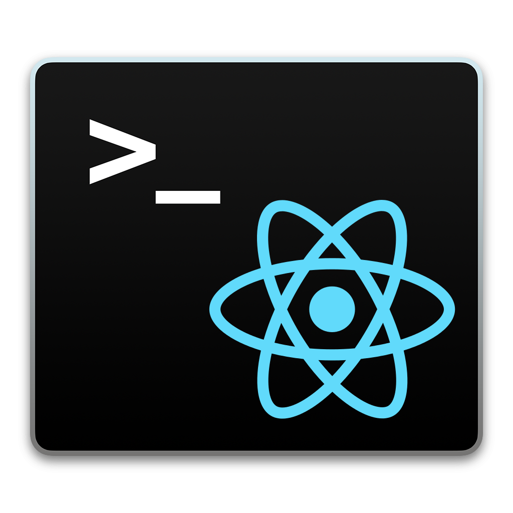

# react-console-emulator

A simple, powerful and highly customisable Unix terminal emulator for React.

[Live demo](https://linuswillner.me/react-console-emulator/)  
[Configuration guide](docs/CONFIG.md)  
[Command API](docs/API.md)

## Features

- Highly customisable: Add custom responses, restyle and tweak the terminal to your liking and much more.
- A Unix terminal in the browser: Accurately emulate a native Unix terminal in the browser with no setup required.
- Familiar shortcuts: The terminal can keep track of commands and allows the user to recall them at their behest.
- Easy and powerful command system: Execute code from your own application and send the results to the terminal output.
- Async output support: Push output to the terminal at any time, even after a command response has been emitted.
- Unlimited concurrency: Register as many terminals as you like with no risk of input confusion.

## Usage

```jsx
import React, { Component } from 'react'
import Terminal from 'react-console-emulator'

const commands = {
  echo: {
    description: 'Echo a passed string.',
    usage: 'echo <string>',
    fn: function () {
      return `${Array.from(arguments).join(' ')}`
    }
  }
}

export default class MyTerminal extends Component {
  render () {
    return (
      <Terminal
        commands={commands}
        welcomeMessage={'Welcome to the React terminal!'}
        promptLabel={'me@React:~$'}
      />
    )
  }
}
```

## License

MIT © Linus Willner and Curtis Fowler.  
"React" and any associated logos are trademarks of Facebook, Inc.
